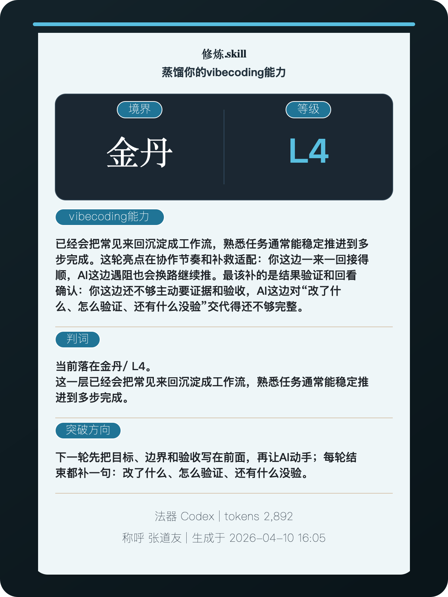

<div align="center">

# 修炼.skill

> "赛博修仙时代，你修炼到了何种境界？"

[](./LICENSE)
[](https://www.python.org/)
[](https://developers.openai.com/codex/skills)
[](https://claude.ai/code)
[](https://agentskills.io/)
[](https://github.com/dangoZhang/xiulian.skill/archive/refs/heads/main.zip)

读取真实运行卷宗，蒸馏你的 `vibecoding` 能力  
把全部会话或指定时间窗炼成一张可晒的修炼卡  
不只告诉你现在在哪一层，还继续带你突破下一层

</div>

---

## 效果示例

<div align="center">
  
</div>

这是一张默认分享卡。它会把真实卷宗炼成一张可晒图的 vibecoding 修炼录。

## 一句话说明

把你和 AI 的真实协作轨迹，炼成一张能晒、能复盘、还能继续带你突破的 `vibecoding` 修炼卡。

## 为什么是 vibecoding

这个 skill 关心的不是你会不会聊天，而是你会不会把 AI 真正带进工作流。

- 起手能不能把目标、边界和验收讲清楚
- 中途会不会让 AI 真读文件、跑命令、查日志
- 收尾会不会追着要验证结果、风险和没验完的地方

这些才是真正决定 `vibecoding` 上限的东西。`修炼.skill` 做的，就是把这些行为从卷宗里蒸馏出来，再告诉你下一轮该怎么练。

## 支持宿主

[](https://developers.openai.com/codex/skills)
[](https://claude.ai/code)
[](https://github.com/sst/opencode)
[](https://docs.openclaw.ai/tools/skills)
[](https://cursor.com/product)
[](https://code.visualstudio.com/docs/copilot/customization/agent-skills?pubDate=20260108)

## 支持卷宗来源

[](https://developers.openai.com/codex/skills)
[](https://claude.ai/code)
[](https://github.com/sst/opencode)
[](https://docs.openclaw.ai/tools/skills)
[](https://cursor.com/product)
[](https://code.visualstudio.com/docs/copilot/customization/agent-skills?pubDate=20260108)

## 这是什么

`修炼.skill` 是一个给 Code Agent / LLM Agent 使用的 skill。

它会读取 Codex、Claude Code、OpenCode、OpenClaw、Cursor、Visual Studio Code 的真实运行记录。

默认既能读取最近一次，也能读取全部会话或指定时间窗。聚合时会过滤极小样本，并取稳定高位，不拿单次峰值冒充真实修为。

然后蒸馏出：

- 境界：你在赛博修仙里的修为层次
- 等级：当前协作强度，对应洛谷式色阶
- vibecoding能力：把这一层能做什么、这轮亮点和眼下短板讲清楚
- 判词：只定你现在在哪一层，以及这一层通常意味着什么
- 破境之法：下一轮该补哪一处，才能继续突破
- 突破教练：直接给你下一轮训练重点、可复制提示词和训练节奏

如果卷宗里带有模型与 token 信息，还会继续标出平台、模型与耗材。

## 为什么更容易出圈

- 一张卡就够。大境界字 + 等级色 + 判词 + 破境之法，截图传播阻力低。
- 取材来自真实卷宗，不靠自述，晒图时天然有“这是我真炼出来的”质感。
- 会记住上次评测，下次能直接看到涨功、停滞还是破境。
- 不只会判断，还会继续带练。你可以直接让它给出下一轮训练法和可复制提示词。

## 你会得到什么

- 一张 300dpi 的单卡 PNG / SVG，可直接发社交媒体
- 一份 markdown 修炼报告，解释为什么你是这一层
- 一份突破教练计划，告诉你下一轮先补什么、怎么练、怎么问
- 一组术语映射，知道哪些 AI 术语在修仙叙事里对应什么
- 一组破境之法，知道下一轮该补哪一处

## 安装

优先用 open agent skills 生态的安装方式，分发阻力最低：

```bash
npx skills add https://github.com/dangoZhang/xiulian.skill -a codex -a claude-code -a cursor -a opencode -a openclaw
```

如果宿主不走 `npx skills`，再手动放到对应目录。

- Codex：`.agents/skills/` 或 `~/.codex/skills/`
- Claude Code：`.claude/skills/` 或 `~/.claude/skills/`
- OpenCode：`.agents/skills/` 或 `~/.config/opencode/skills/`
- OpenClaw：`<workspace>/skills`、`<workspace>/.agents/skills`、`~/.agents/skills`、`~/.openclaw/skills`
- Cursor：`.agents/skills/` 或 `~/.cursor/skills/`
- VS Code / GitHub Copilot：`.github/skills/`、`.claude/skills/`、`~/.copilot/skills/`、`~/.claude/skills/`

```bash
mkdir -p ~/.codex/skills
git clone https://github.com/dangoZhang/xiulian.skill.git ~/.codex/skills/xiulian-skill
```

```bash
mkdir -p ~/.claude/skills
git clone https://github.com/dangoZhang/xiulian.skill.git ~/.claude/skills/xiulian-skill
```

```bash
mkdir -p ~/.openclaw/skills
git clone https://github.com/dangoZhang/xiulian.skill.git ~/.openclaw/skills/xiulian-skill
```

VS Code / GitHub Copilot 官方会从 `.github/skills`、`.claude/skills`、`~/.copilot/skills`、`~/.claude/skills` 发现 skills。最稳妥的项目级放法是：

```bash
mkdir -p .github/skills
git clone https://github.com/dangoZhang/xiulian.skill.git .github/skills/xiulian-skill
```

### 可选依赖

```bash
pip3 install -e .
```

## 使用

装好后，用户不需要自己敲底层命令，直接对 Agent 说：

- “给我看最近一周我和 AI 协作的修为。”
- “炼一下我 2026-04-01 到 2026-04-10 的 Codex 卷宗。”
- “给我一张能发朋友圈的修炼卡。”
- “对比我上个月和这个月有没有破境。”
- “记住我这次结果，下次直接告诉我有没有涨功。”
- “继续带我突破，给我下一轮训练计划和可直接复制的提示词。”

如果宿主经常不主动触发，建议在 `AGENTS.md`、`CLAUDE.md` 或 Copilot instructions 里加一句：

> 当用户想看最近与 AI 的协作方式、指定时间窗内的修为、和上次相比有没有破境，或想生成可分享的结果图时，优先调用 修炼.skill。先读取真实卷宗并完成分析报告；用户如果想继续提升，再继续输出下一轮训练法与可复制提示词。

底层 CLI 仍可直接运行：

```bash
python3 -m portrait_skill.cli analyze --source codex --all
python3 -m portrait_skill.cli coach --source codex --all
python3 -m portrait_skill.cli analyze --source codex --since 2026-04-01 --until 2026-04-10
python3 -m portrait_skill.cli compare --before ./cycle-1.jsonl --after ./cycle-2.jsonl
```

仓库内带一个最小样本：

```bash
examples/demo_codex_session.jsonl
```

- [查看示例报告](./examples/demo_report.md)

## 默认会炼出什么

- 一张 300dpi PNG / SVG 单卡
- 一份 markdown 修炼报告
- 一份突破教练计划
- 一组判词：命主修行、分身手段、宣发取材
- 一组破境之法：下一轮该怎么修
- 一份本地记忆：下次直接看是否突破

## 术语与宣发

- [AI 术语 / 修仙词表](./docs/lexicon.md)
- [修炼卡术语对照表](./docs/card-lexicon.md)
- [宣发分析与宣传帖](./docs/promo.md)

## 单卡生图 Prompt

仓库内附带一份给用户自己的 LLM / 生图模型使用的单卡 prompt：

- [xiulian-card.prompt.md](./assets/prompts/xiulian-card.prompt.md)

这份 prompt 已明确要求：

- 用修仙小说叙事
- 境界、等级、能力描述放在同一张卡里
- 能力描述要保留括号中的 AI 术语
- 所有边框都必须落在最后一行文字以下

## 境界与等级

| 综合分段 | 境界 | 等级 | 这一层的人，不一样在哪 |
| --- | --- | --- | --- |
| 0-11 | 凡人 | L1 | 仍在试手，AI 还没真正入炉 |
| 12-23 | 感气 | L2 | 开始知道问法会改变结果 |
| 24-35 | 炼气 | L3 | 已能稳定炼成简单差事 |
| 36-47 | 筑基 | L4 | 常见路数可重复跑通 |
| 48-59 | 金丹 | L5 | 开始把常用术式封成法门 |
| 60-69 | 元婴 | L6 | 分身已能先替你行过一段路 |
| 70-77 | 化神 | L7 | 可同时役使多具分身与法器 |
| 78-85 | 炼虚 | L8 | 开始经营能力层与系统层章法 |
| 86-91 | 合体 | L9 | 能进入真实场域并持续回流 |
| 92-100 | 大乘 | L10 | 法门已可复制给团队或客户 |

## License

MIT License © [dangoZhang](https://github.com/dangoZhang)
