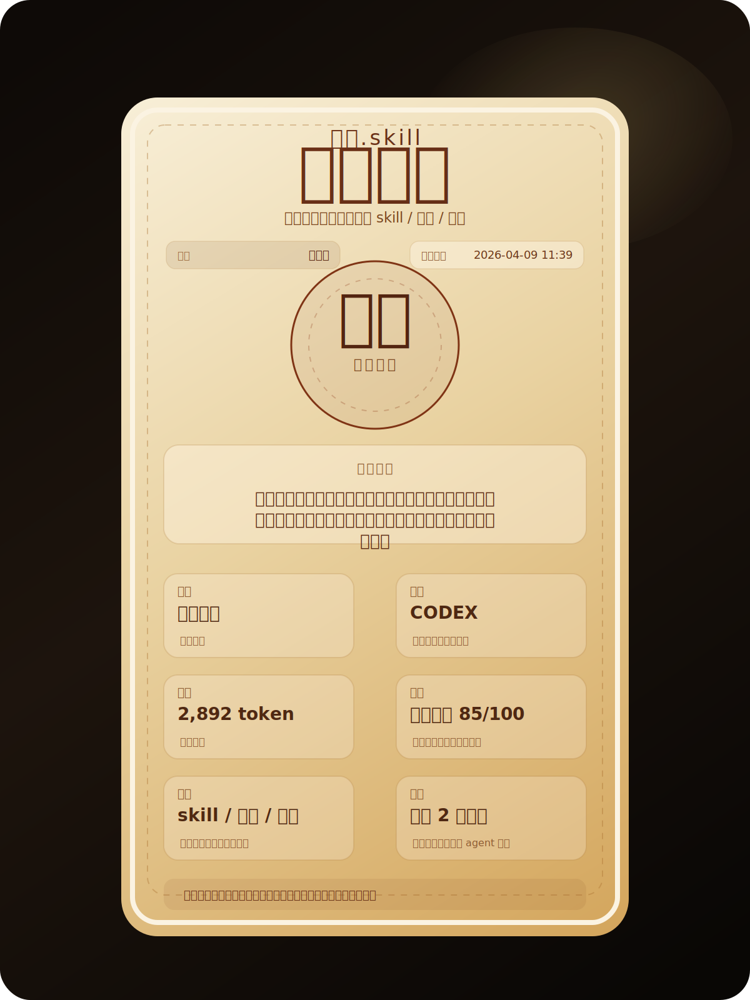
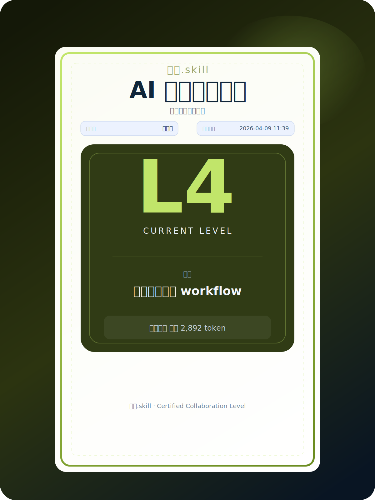

<div align="center">

# 画像.skill

> "AI浪潮，灵气复苏，看赛博修仙时代的你，修炼到了何种境界？"

[](./LICENSE)
[](https://www.python.org/)
[](https://developers.openai.com/codex/skills)
[](https://claude.ai/code)
[](https://agentskills.io/)
[](https://github.com/dangoZhang/portrait.skill/archive/refs/heads/main.zip)

读取 Codex、Claude Code、OpenCode、OpenClaw、Cursor、Visual Studio Code 的真实运行记录  
将你与 AI 的协作记录投入炉中，炼出你的一张赛博修仙画像  
测出你的境界、灵根、资质与修炼时长，并能进一步指导突破方向  
如果你不喜欢修仙叙事，也可以选择领取 AI 协作能力证书

⚠️ 本项目用于个人协作复盘、成长追踪与方法训练，不用于伪造履历、不保存隐私数据。

</div>

---

## 效果示例

<div align="center">
  
  
</div>

左侧是修仙画像，右侧是 AI 协作能力证书。

**支持平台**

[](https://developers.openai.com/codex/skills)
[](https://claude.ai/code)
[](https://github.com/sst/opencode)
[](https://github.com/bmorphism/openclaw)
[](https://www.cursor.com/)
[](https://code.visualstudio.com/)

仓库内自带一个最小样本：

```bash
examples/demo_codex_session.jsonl
```

- [查看示例报告](./examples/demo_report.md)

---

## 安装

这是一个给 Code Agent / LLM Agent 使用的 `skill`。正确路径是把仓库安装到 Agent 的技能目录，然后直接让 AI 调用它。

安装目录名建议使用 `portrait-skill`。

### 安装到 Codex

```bash
mkdir -p ~/.codex/skills
git clone https://github.com/dangoZhang/portrait.skill.git ~/.codex/skills/portrait-skill
```

安装后，可在 Codex 对话中直接点名 `$portrait-skill`，或直接要求它分析你的运行卷宗。

### 安装到 Claude Code / OpenCode

```bash
mkdir -p ~/.claude/skills
git clone https://github.com/dangoZhang/portrait.skill.git ~/.claude/skills/portrait-skill
```

OpenCode 支持直接读取 `~/.claude/skills/<name>/SKILL.md`，这里同样可用。

### 安装到 OpenClaw

```bash
mkdir -p ~/.openclaw/workspace/skills
git clone https://github.com/dangoZhang/portrait.skill.git ~/.openclaw/workspace/skills/portrait-skill
```

如果你只想在当前项目启用，也可以安装到项目内：

```bash
mkdir -p .claude/skills
git clone https://github.com/dangoZhang/portrait.skill.git .claude/skills/portrait-skill
```

### 依赖（可选）

```bash
pip3 install -e .
```

---

## 使用

安装完成后，用户不需要手动敲底层命令，只需要直接对 Agent 说：

- “给我一个我与 AI 协作的画像。”
- “我最近使用 AI 的境界如何？”
- “帮我看看我这周和 AI 配合得怎么样。”
- “把我最近一段时间的 Codex 会话炼一下，看看我到了哪一层。”
- “我不想看修仙背景，直接给我 AI 协作能力证书。”
- “比较一下我上个月和这个月，看看我和 AI 的配合有没有升级。”

底层 CLI 是 Agent 的内部实现。常见内部调用形态如下：

```bash
python3 -m portrait_skill.cli analyze --source codex --all --certificate both
python3 -m portrait_skill.cli analyze --source codex --since 2026-04-01 --until 2026-04-09 --certificate both
python3 -m portrait_skill.cli compare --before ./cycle-1.jsonl --after ./cycle-2.jsonl --certificate both
```

---

## 境界等级对应表

| 综合分段 | 修仙境界 | 证书等级 | 这一层的人，不一样在哪 |
| --- | --- | --- | --- |
| 0-11 | 凡人 | L1 | 还把 AI 当玩具，不当生产力 |
| 12-23 | 感气 | L2 | 开始知道提问方式会改变结果 |
| 24-35 | 炼气 | L3 | 已经有 prompt 手感，能稳定做简单任务 |
| 36-47 | 筑基 | L4 | 开始有固定 workflow，同类任务能反复跑通 |
| 48-59 | 金丹 | L5 | 开始把自己的做法封成 skill / 模板 / 模块 |
| 60-69 | 元婴 | L6 | 开始拥有“能替自己先干一段活”的分身 |
| 70-77 | 化神 | L7 | 能同时调多个 agent、多个工具协同完成任务 |
| 78-85 | 炼虚 | L8 | 不再做单任务优化，开始做能力层和世界模型 |
| 86-91 | 合体 | L9 | 人负责判断和担责，agent 负责执行和回流 |
| 92-96 | 大乘 | L10 | 能把自己的方法复制给团队或客户 |
| 97-98 | 渡劫 | L11 | 经得住真实业务、客户、异常、合规检验 |
| 99-100 | 飞升 | L12 | 工作方式已经被 AI 重写，不再只是“会用工具” |
---
更多修仙元素和AI能力对应关系等你在画像中探索！

## License

MIT License © [dangoZhang](https://github.com/dangoZhang)
