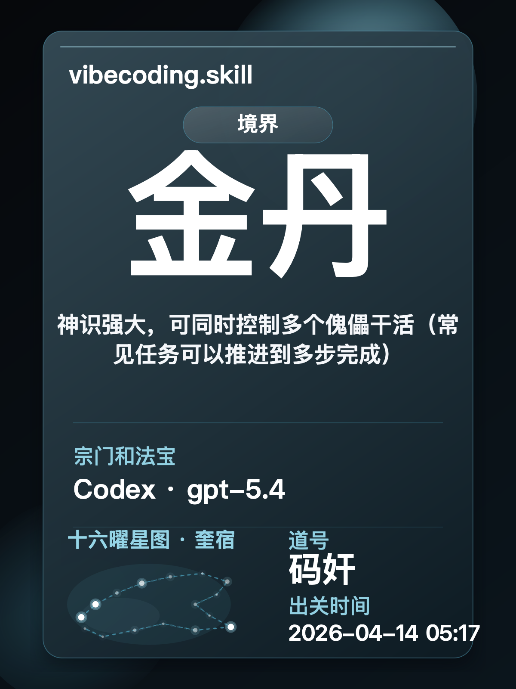

# 码奸 的 vibecoding 导出包

这是从真实协作记录里导出的共享包，当前判断为 `L4`。

这份导出包会保留 码奸 和 AI 协作时最稳定的节奏，方便交给另一个也在用 vibecoding.skill 的人继续复用。

<table>
<tr>
<td width="54%" valign="top">

### 你怎么和 AI 协作

`目标先收束` 
`上下文给够` 
`结果可验证` 
`证据优先` 

码奸，你的水平已经达到了L4级，你已经能把常见任务沿着上下文稳定推到多步完成，熟悉的问题不太会半路掉线。 这轮 16 维里最稳的是上下文供给、目标 framing。 当前最该补的是抽象复用、约束治理。当前最稳的是“上下文供给”，偏好把路径、文件、背景和历史直接交给 agent，减少来回确认。

当前最稳的是“工具编排”，倾向让 agent 读文件、跑命令、查日志、落脚本，而不是停在口头判断。

当前最该补的是“抽象复用”和“约束治理”，已有初步信号，说明会把一次成功沉成 skill、模板、流程、规则或模块，方便继续复用。 每轮只动一个核心变量，守住其余条件，避免气机紊乱。

- 写 prompt 时会先把目标、边界和验收钉住。
- 给 code agent 下指令时，路径、文件和背景通常会一次性交代清楚。
- 更信文件、命令和日志里的证据，不爱把 prompt 写成空话。

</td>
<td width="46%" valign="top">

</td>
</tr>
</table>

## 分享哪个文件

- 想让另一个也在用 vibecoding.skill 的人直接复用：分享整个目录，或压缩后的 zip。
- 想让别人快速看懂这套做法：分享 `PROFILE.md`。
- 想让别人看完整判断依据：分享 `REPORT.md`。
- 想发群或发社交平台：分享 `assets/vibecoding-card-xianxia.png`。

## 这包里有什么

- `SKILL.md`：蒸馏结果 skill，本包核心入口。调用名是 `vibecoding-profile-f11a0caa`，显示标题是 `码奸.skill`。
- `.cursor/rules/vibecoding-profile-f11a0caa.mdc`：给 Cursor 原生读取。
- `PROFILE.md`：压缩后的习惯画像，适合转发和快速阅读。
- `REPORT.md`：完整报告，包含判断依据和突破建议。
- `snapshot.json`：结构化结果，方便二次开发。
- `DISTILLED_SKILL.json`：二级 skill 的结构化蒸馏结果。
- `assets/`：分享卡图片。

## 这套习惯的摘要

- 画像来源：先做 16 维蒸馏，再由主报告生成画像字段；README 和共享页只复用报告结果。
- 等级：`L4`
- 判断：你已经能把常见任务沿着上下文稳定推到多步完成，熟悉的问题不太会半路掉线。 这轮 16 维里最稳的是上下文供给、目标 framing。 当前最该补的是抽象复用、约束治理。
- 取样规模：`2,892 tokens · 4 条消息 · 2 次工具调用`
- 导出时间：`2026-04-14 05:17`

## 这套 vibecoding 习惯

- 起手习惯：当前最稳的是“上下文供给”，偏好把路径、文件、背景和历史直接交给 agent，减少来回确认。
- 推进习惯：当前最稳的是“工具编排”，倾向让 agent 读文件、跑命令、查日志、落脚本，而不是停在口头判断。
- 容易掉点的地方：当前最该补的是“抽象复用”和“约束治理”，已有初步信号，说明会把一次成功沉成 skill、模板、流程、规则或模块，方便继续复用。

## 下一步怎么把 AI 接得更深

- 每轮只动一个核心变量，守住其余条件，避免气机紊乱。
- 每轮结束都留下看得见的验证结果。

## 接收方怎么用

更顺手的场景是双方都已经在自己的宿主里装了 `vibecoding.skill`。
`vibecoding.skill` 是入口 skill，这次蒸馏出的结果 skill 调用名是 `vibecoding-profile-f11a0caa`。

1. 把整个目录或 zip 发给接收方。
2. 接收方在自己的对话里把这份导出包交给 `vibecoding.skill`。
3. 让 `vibecoding.skill` 先读取并调用 `vibecoding-profile-f11a0caa`。
4. 再按这套方式继续协作。

## 接收方可以直接说

- 这是同事的导出包。先读他的画像，再调用 `vibecoding-profile-f11a0caa` 和我一起做当前任务。
- 先按这份导出包总结协作习惯，再切到 `vibecoding-profile-f11a0caa` 开始当前任务。
- 按这份画像指出我最该补的动作。
- 结合这份画像，继续帮我把 AI 融入现在的工作流程。
